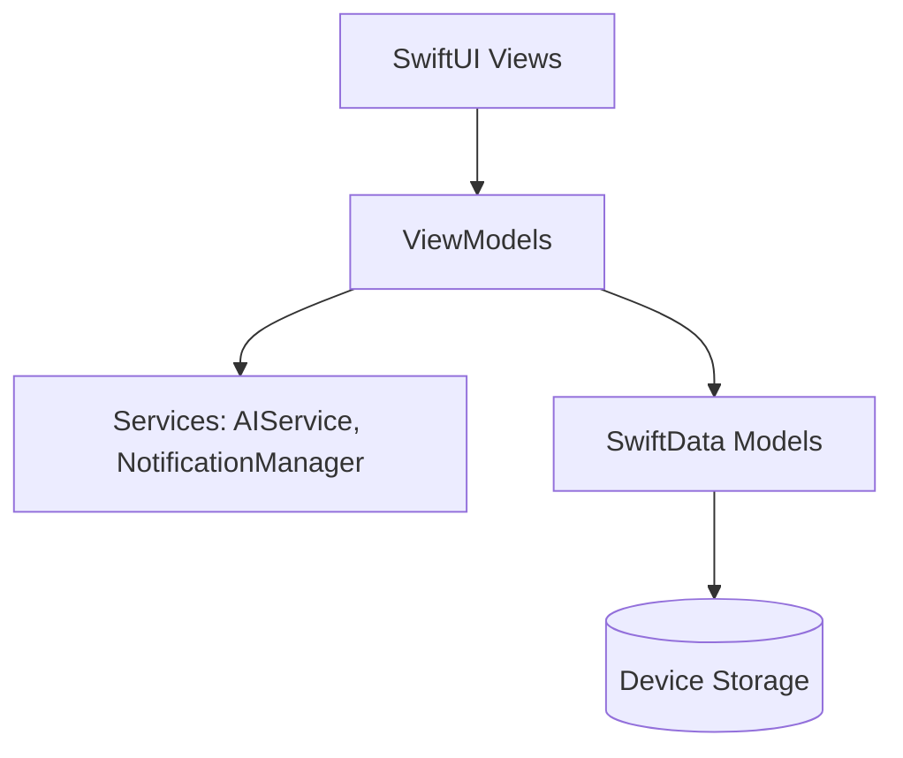

# StudyFlow AI

An AI-powered student productivity iOS application built using SwiftUI, SwiftData, Swift Charts, and MVVM architecture. StudyFlow AI combines scheduling, flashcards, concept summaries, and streak tracking with automated, local background alerts and home screen widgets.

## Key Features

*   **Smart Study Planner & Timer**: A Pomodoro-style focused study timer with customizable intervals and automated short breaks. Fully optimized with background notifications so you are alerted the second your study session or break ends.
*   **AI Study Assistant**: Deeply integrated with Google's Gemini 3.5 Flash API. Get instant concept explanations, notes summarization, flashcard generation, or customized quizzes right beside your notebook.
*   **Habit Tracker**: Build daily and weekly learning habits with visual progress logs and streak tracking.
*   **Productivity Statistics**: Rich native visualizations built with Swift Charts tracking study hours by subject, weekly tasks completion trends, and habit compliance rates.
*   **Unified Task Manager**: Priority-coded checklist integrated with home screen widgets that automatically updates when you modify your targets.

---

## Architectural Blueprint

The application is engineered around a modular **MVVM Architecture** combined with Apple's modern **SwiftData** persistence engine.



*   **Models**: SwiftData schemas with structural relationships (e.g., `Subject` cascading delete rules to `StudySession` logs).
*   **ViewModels**: Observable actors managing states and transactional operations (handling explicit container saves).
*   **Services**: Framework-level bridges implementing the networking client (Gemini REST client) and user notification queues.

---

## Technical Details

### 1. Robust Background Session Tracking
To guarantee a reliable user experience, the Study Timer does not rely on active thread timers in the background. Instead:
*   It schedules a local notification (`UNTimeIntervalNotificationTrigger`) on `UNUserNotificationCenter` for the exact end time when the timer is started.
*   If the user closes the app or locks their phone, the notification triggers correctly.
*   It tracks wall-clock time using dates (`Date().timeIntervalSince(startDate)`) so that when the app enters the foreground, the elapsed progress matches real-world time elapsed.

### 2. Widget Synchronization Pipeline
The widget reads data shared via `UserDefaults` keys (such as `widget_next_task_title` and `widget_next_task_due`). Whenever tasks are created, completed, or updated (both from the list views or the detail edit views), a static sync script compiles the closest incomplete task and triggers:
```swift
WidgetCenter.shared.reloadAllTimelines()
```
This keeps the iOS home screen widget instantly in sync with in-app data.

### 3. SwiftData Durability
Every state modification (notes additions, study logging, task deletion) is explicitly persisted immediately using:
```swift
try? context.save()
```
This prevents data loss if the application is suspended or terminated by the OS.

---

## Project Structure

```
StudyFlow AI/
├── Models/              # SwiftData Models (TaskItem, Subject, StudySession, etc.)
├── ViewModels/          # Published State Controllers (TaskManager, StudyPlanner, etc.)
├── Views/               # SwiftUI Screens (Dashboard, AI, Tasks, Notes, Stats, Settings)
├── Services/            # Core Services (AIService, NotificationManager)
├── Components/          # Shared Components & UI Subviews (TimerRing, DateExtensions)
├── Widgets/             # iOS Widget Extension entrypoints
├── Preview Content/     # Xcode SwiftUI Preview Canvas mock database containers
├── StudyFlowAIApp.swift # Core Application lifecycle & SwiftData configuration
└── Package.swift        # Swift Package Manager configuration manifest
```

---

## Xcode Setup & Installation

1.  Open **Xcode 15+**.
2.  Choose **File > New > Project** and select **iOS > App**.
3.  Name the project `StudyFlow AI` and configure:
    *   **Interface**: SwiftUI
    *   **Language**: Swift
    *   **Storage**: SwiftData
4.  Drag and drop the directories (`Models/`, `ViewModels/`, `Services/`, `Views/`, `Components/`, `Widgets/`, `Preview Content/`) from this workspace folder into your Xcode Project Navigator.
5.  Replace the default `StudyFlowAIApp.swift` with the file provided in this repository.
6.  To enable Widgets, add a **Widget Extension** target named `StudyFlowWidgets` in your Xcode project, and add the files under `Widgets/` to its source compile files.

---

## API Configuration

To enable the AI Study Assistant:
1.  Go to **Settings** in the application.
2.  Paste your **Gemini API Key** in the API Configuration input.
3.  Verify the live status indicator turns green.

*Your API key is stored securely in the local keychain/UserDefaults on the device and is never uploaded to any external server.*
